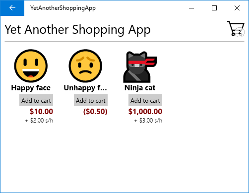

# Payment Request API Sample App

A mini-app that presents a basic shopping experience where a user can buy emoji. This app shows how to use the
[Payment Request APIs](https://docs.microsoft.com/uwp/api/windows.applicationmodel.payments) to implement the checkout experience. It also demonstrates a basic multi-page XAML UI that uses
the Model-View-ViewModel (MVVM) pattern.

This sample runs on the Universal Windows Platform (UWP).

## Features

Payment Request API Sample App demonstrates:

* Using the Payment Request APIs ([Windows.ApplicationModel.Payments](https://docs.microsoft.com/uwp/api/windows.applicationmodel.payments))

## Universal Windows Platform development

Requirements:

* Windows 10 Creators Update - 1703 (or later)
* [Visual Studio 2017 (or later)](https://www.visualstudio.com/downloads/)
* [Windows SDK - Build 15063 (or later)](https://developer.microsoft.com/windows/downloads/windows-10-sdk)

Additionally, to be informed of the latest updates to Windows and the development tools, join the
[Windows Insider Program](https://insider.windows.com/ "Become a Windows Insider").

## Running the sample

**Note:** The platform target currently defaults to ARM, so be sure to change that to x64 or x86 if you want to test on
 a non-ARM device. 

The default project is YetAnotherShoppingApp and you can Start Debugging (F5) or Start Without Debugging (Ctrl+F5) to try
it out. The app will run in the emulator or on physical devices.

## Code at a glance

If you’re just interested in code snippets for certain API and don’t want to browse or run the full sample, check out the
following files for examples of some highlighted features:

* [WindowsPaymentOperation.cs](YetAnotherShoppingApp/Views/WindowsPaymentOperation.cs#L25)
	- Uses [PaymentMediator.SubmitPaymentRequestAsync](https://docs.microsoft.com/uwp/api/windows.applicationmodel.payments.paymentmediator#Windows_ApplicationModel_Payments_PaymentMediator_SubmitPaymentRequestAsync_) to initiate the checkout experience.
* [BasicCardPaymentProtocol.cs](YetAnotherShoppingApp/Models/BasicCardPaymentProtocol.cs#L25)
	- Handles the boilerplate of the [W3C Basic Card Payment Method](https://www.w3.org/TR/payment-method-basic-card/).
